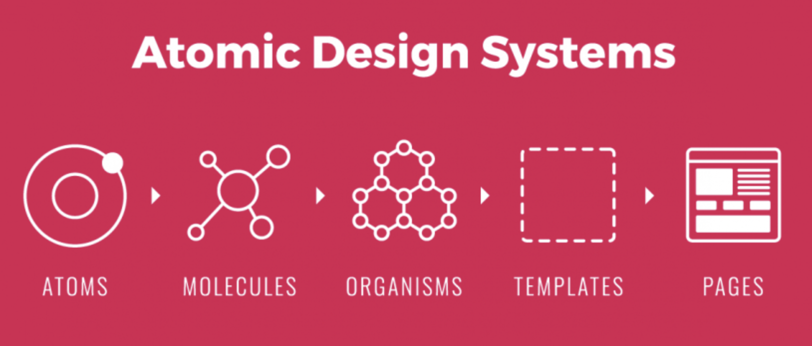
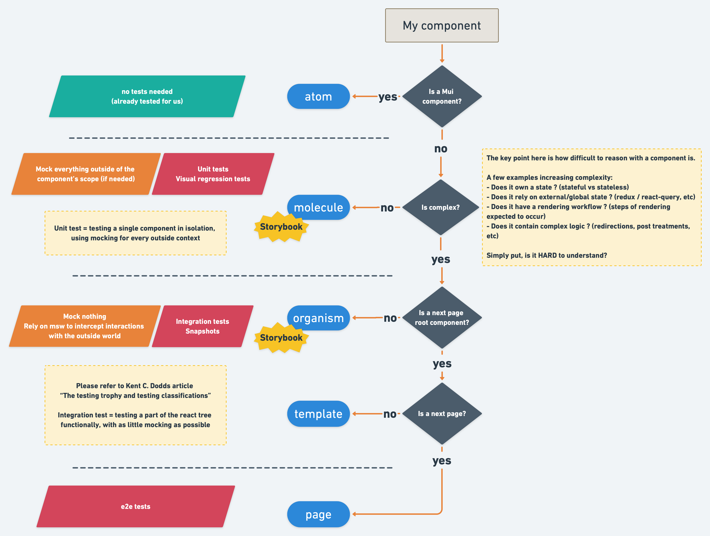

# ✨ test-storybook-msw

[](https://github.dev/jpb06/test-storybook-msw)
[](https://test-storybook-msw.vercel.app/front)

[](https://sonarcloud.io/summary/new_code?id=jpb06_test-storybook-msw)
[](https://sonarcloud.io/summary/new_code?id=jpb06_test-storybook-msw)
[](https://sonarcloud.io/summary/new_code?id=jpb06_test-storybook-msw)
[](https://sonarcloud.io/summary/new_code?id=jpb06_test-storybook-msw)
[](https://sonarcloud.io/summary/new_code?id=jpb06_test-storybook-msw)
[](https://sonarcloud.io/summary/new_code?id=jpb06_test-storybook-msw)
[](https://sonarcloud.io/summary/new_code?id=jpb06_test-storybook-msw)
[](https://sonarcloud.io/summary/new_code?id=jpb06_test-storybook-msw)
[](https://sonarcloud.io/summary/new_code?id=jpb06_test-storybook-msw)
[](https://sonarcloud.io/summary/new_code?id=jpb06_test-storybook-msw)


Here is a little POC exploring a few subjects:

❇️ How to architecture an application

❇️ What stategy to adopt to test a frontend app

❇️ How to give visibility to the outside world (a product team for example) about how well and fast the team is working on a user story

❇️ How to use storybook in a next app that requires a basePath

## ⚡ Working with an application containing many components

Our goal here is to classify components in order to know easily how we should test them: some components are simple and may only need a few unit tests to get the team confident about their robustessness. On the other hand, others may be quite complex, embedding interactions with the outside world, or complex logic for example.

Categorizing components can also help us defining what could be a milestone for us in the delivery of a user story.



We can use [atomic design](https://atomicdesign.bradfrost.com/chapter-2/) as a basis to classify our components. This approach has several advantages:

### 🔶 Common language used in tech team and in product team

It's easier to work together if a common language is used by both the product team and the dev team, instead of having a purely technical way to define components on one side, and a product driven definition on the other side.

### 🔶 Removing ambiguity about testing

How should I test my component? Which rules should I follow when testing it? Why should I even choose that testing strategy in place on another?

We can make it easier for every developer in our team to answer these questions right away by binding a testing strategy to each type of component. This clarifies what is expected for a component as well (code reviews ...).

### 🔶 Plan ahead

Classifying components will make it easier for us on the long run: we will be able to reason by scale and to use a divide & conquer approach when preparing a user story. This page contains two independent parts with complex rendering? Well, that means we will have two organisms then! That means we will write two integration tests!

### 🔶 Clarify the amount of job that needs to be done

It also can help us refine our estimations when we want to know how complex a user story is, by taking a look at the provided UI model. We can easily split it down in organisms, which themselves will be made with molecules, etc... Sizing the user story will be much easier by taking this approach.

### 🔶 Create milestones

Using storybook, we can easily demonstrate how well is advancing the user story, and validate distinct parts of the user story with product team.

## ⚡ Cool, but what does it mean concretely?

### 🔶 Classifying our components

Let's reflect on the classification we want to use and how it would impact our application folders structure. Here is a proposal:

| Category  | Description                                                                                                                                                                                                          |
| --------- | -------------------------------------------------------------------------------------------------------------------------------------------------------------------------------------------------------------------- |
| Atoms     | Since we are using an UI library (Mui), we can consider components coming from this library to be **Atoms**. Somebody also is responsible for testing them, so no need to do that!                                   |
| Molecules | Simple components only do one thing. They have little to no logic on their own; they often are just presentational                                                                                                   |
| Organisms | Some compoents are bigger, embedding complex logic or having sophisticated rendering logic. This is often where something can go wrong in our app: several small blocks having to work together to come to a result. |
| Templates | We may want to create a 1-1 relationship between user stories and **Templates**. In that context, templates would be the root component of an entire page, made from several organisms                               |
| Pages     | Finally **Pages** would pretty much be nextjs pages...                                                                                                                                                               |


#### 🧿 `molecules` and `organisms` folders

In that proposal, we will have these folders at several levels, by order of genericity:

- Inside the `src` folder of the application, when these components are meant to be used by several user stories.
- Inside a user story folder, when the components will only be used in that user story.

### 🔶 Defining a decision tree

With this in mind, we can now think about a decision tree to identify the type of every component. We will also take advantage of this to define a few things:

- What should and shouldn't be on storybook.
- Which testing strategy should be used for each category.



## ⚡ Testing strategy

Let's talk a bit about the various types of tests we can do and what problems they do solve. What we aim to do is trophy testing, basing ourself on [Typescript](https://www.typescriptlang.org), [jest](https://jestjs.io), [testing library](https://testing-library.com), [msw](https://mswjs.io) and [cypress](https://www.cypress.io).


### 🔶 Unit tests

They focus on testing a module - could be a component or a function - in isolation. That means any outside context this module may rely upon will be mocked. This are pretty straightforward tests, which are typically really fast.

You can find unit tests in the [molecules folder](./src/molecules). Here is a simple example:

```typescript
describe('TopAlert component', () => {
  const error = 'Oh no!';
  const children = 'My child';

  it('should display a banner and a brand', () => {
    render(
      <TopAlert severity="error" errorText={error}>
        {children}
      </TopAlert>
    );

    expect(screen.getByText(children)).toBeInTheDocument();
    expect(screen.getByText(error)).toBeInTheDocument();
  });
});
```

### 🔶 Visual regression tests

These tests check that the small bricks of our app didn't drastically change visually. This is pretty useful when we defined our own system design relying on a whole set of generic components.

### 🔶 Snapshots

Snapshots are useful to make sure we didn't visually break another part of the application by touching a generic component for example.

You can find snapshot tests in the templates folder:

- [User profile](./src/templates/github-user/organisms/user-profile/UserProfile.spec.tsx).
- [User skills](./src/templates/github-user/organisms/user-skills//UserSkills.spec.tsx).

```typescript
it('should match snapshot', async () => {
  githubProfileQueryHandler(githubProfileQueryMockData, 200, true);

  const { baseElement } = render(<UserProfile />);

  // We make sure to reach the render we want to assert with our snapshot
  await screen.findByRole('img');

  expect(baseElement).toMatchSnapshot();
});
```

### 🔶 Integration tests

Integration tests have the highest return on investment because they are not as hard to write and maintain as e2e tests while giving us good confidence about a part of our system.

You can find integration tests in the templates folder:

- [User profile](./src/templates/github-user/organisms/user-profile/UserProfile.spec.tsx).
- [User skills](./src/templates/github-user/organisms/user-skills//UserSkills.spec.tsx).

```typescript
it('should display skills', async () => {
  githubProfileQueryHandler(githubProfileQueryMockData, 200, true);

  render(<UserProfile />);

  const {
    info: { name, email },
    extra: {
      raw_info: { followers, public_repos },
    },
  } = githubProfileQueryMockData;

  await screen.findByText(name);
  expect(screen.getByText(email)).toBeInTheDocument();
  expect(screen.getByText(followers)).toBeInTheDocument();
  expect(screen.getByText(public_repos)).toBeInTheDocument();
});
```

### 🔶 End to end testing

The tests giving us the most confidence. They also cost a lot. So it's generally wiser to only write e2e for key features of our application; the ones that represent a critical risk for the product.

## ⚡ Storybook

Storybook gives us a great opportunity to demonstrate easily parts of our work on user stories instead of waiting for the completion of the entire user story. Let's take an example:

On [this page](https://test-storybook-msw.vercel.app/front), we have two independent blocks: one for the user profile on github and one for the user skills. Instead of doing a demo of the entire page (which may reprensent a user story), we can use storybook to deliver parts of the user story as soon as they are completed:

### 🔶 Molecules

- [Profile infos](https://test-storybook-msw.vercel.app/front/storybook/index.html?path=/story/user-stories-github-user-molecules-profileinfo--nominal-case)
- [User avatar](https://test-storybook-msw.vercel.app/front/storybook/index.html?path=/story/user-stories-github-user-molecules-useravatar--nominal-case)
- [Card skeleton](https://test-storybook-msw.vercel.app/front/storybook/index.html?path=/story/user-stories-github-user-molecules-cardskeleton--nominal-case)
- [List skeleton](https://test-storybook-msw.vercel.app/front/storybook/index.html?path=/story/user-stories-github-user-molecules-listskeleton--nominal-case)

### 🔶 Organisms

- [user profile](https://test-storybook-msw.vercel.app/front/storybook/index.html?path=/story/user-stories-github-user-organisms-userprofile--nominal-case)
- [user skills](https://test-storybook-msw.vercel.app/front/storybook/index.html?path=/story/user-stories-github-user-organisms-userskills--nominal-case)

## ⚡ The basepath issue

In our example here, our app is using a basepath. Let's see what it means for storybook:

### 🔶 Unifying next config

The first step is to unify next config, where basepath will be defined:

```javascript
// config/basePath.js

const basePath = process.env.NEXT_PUBLIC_BASE_PATH ?? '/front';

module.exports = {
  basePath,
};
```

### 🔶 next.config.js

Let's append the "Service-Worker-Allowed" header to each response, overriding the default worker's scope:

```javascript
module.exports = {
  basePath: '/front',
  async headers() {
    return [
      {
        source: '/(.*)',
        headers: [
          {
            key: 'Service-Worker-Allowed',
            value: '/',
          },
        ],
      },
    ];
  },
};
```

### 🔶 Storybook config

We will have to use a config for production and another for dev, because of the basepath. In dev mode, there won't be any basepath since we launch storybook in dev mode.

#### 🧿 dev config

```javascript
import { initialize } from 'msw-storybook-addon';

// Initialize MSW
initialize({ onUnhandledRequest: 'bypass' });
```

#### 🧿 prod config

```javascript
import { initialize } from 'msw-storybook-addon';
import { basePath } from '../../config/basePath';

// Initialize MSW
initialize({
  serviceWorker: {
    url: `${basePath}/mockServiceWorker.js`,
    options: {
      scope: '/',
    },
  },
});
```
